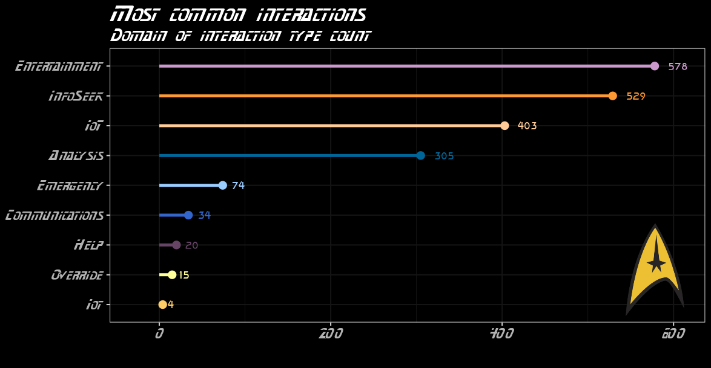

# TidyTuesday
Code and plots of my submissions to the #tidytuesday challenge

## Highlights (click on image to go to code):  

### [Star Trek](p8)
___

### [Emmys](p13)
___

###[Scooby Doo Rankings](p3a)
___

###[Scooby Doo Monsters](p3b)
___

### [Animal Rescues](p1)
___

### [Billboard 100](p12)
___
### [Spice Girls](p14)
___
