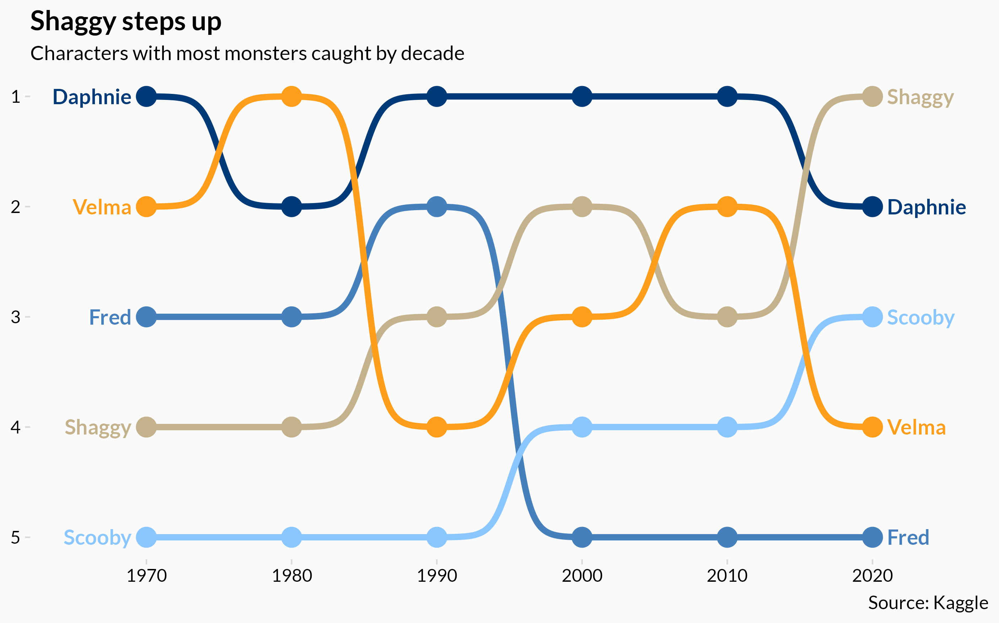
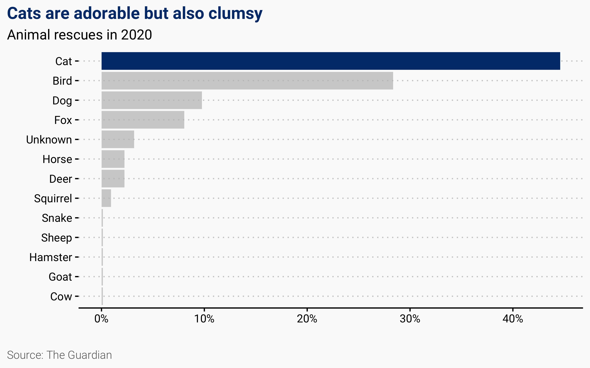

# TidyTuesday
Code and plots of my submissions to the #tidytuesday challenge

## Highlights (click on image to go to code):  

### [Star Trek](08-star-trek/startrek.R)

___

### [Emmys](13-emmys/emmys.R)

___

### [Scooby Doo Rankings](03-scooby-doo/caught_rank.R)

___

### [Scooby Doo Monsters](03-scooby-doo/monster_types.R)

___

### [Animal Rescues](01-animal-rescue/bar_chart.R)

___

### [Billboard 100](12-billboard100/billboard.R)

___

### [Spice Girls](14-spice-girls/spice-girls.R)

